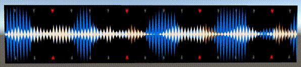
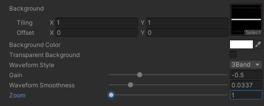

# Waveform Shader for use with Audio Link


# Requirements
- [vrc-udon-audio-link](https://github.com/llealloo/vrc-udon-audio-link) v3.0+

# Installation
Copy shader files into your project or download latest [unitypackage](https://github.com/ryushunosuke/pieoneer-waveform-shader/releases/latest)

# Usage
Drag and drop the provided prefab or apply the shader onto any material.

Edit shader properties to your needs.



# Compatibility
It is possible to use this shader with audio-link <v3.0. Change the `#include` line inside of .shader file

from
```
#include "Packages/com.llealloo.audiolink/Runtime/Shaders/AudioLink.cginc"
```
to
```
#include "Assets/AudioLink/Shaders/AudioLink.cginc"
```